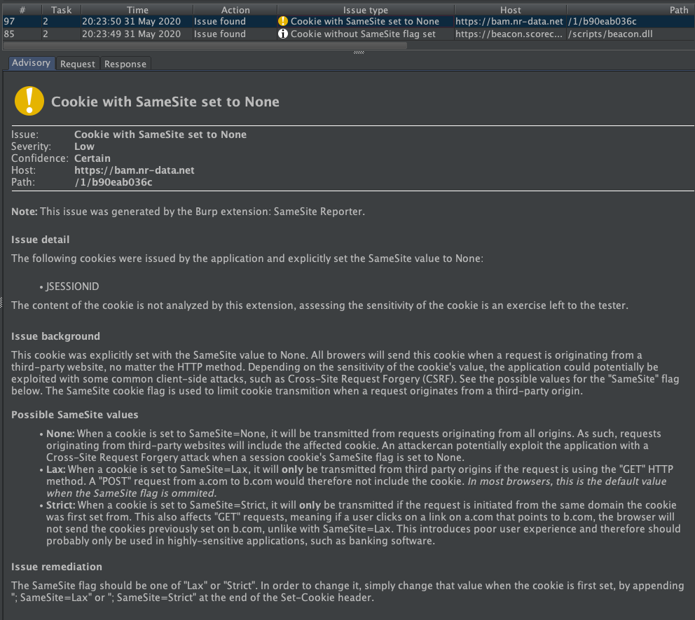

# burp-samesite-reporter
Burp extension that passively reports various SameSite flags.

This extension reports cases where the `SameSite` cookie flag is explicitly set to `None`, and when it is missing. Handy for developers who want to write secure code, and testers who like me often forget to check the `SameSite` value of important cookies.

### SameSite=None

### SameSite Missing

